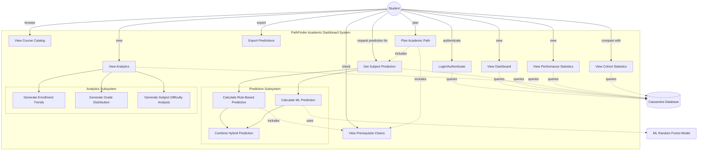
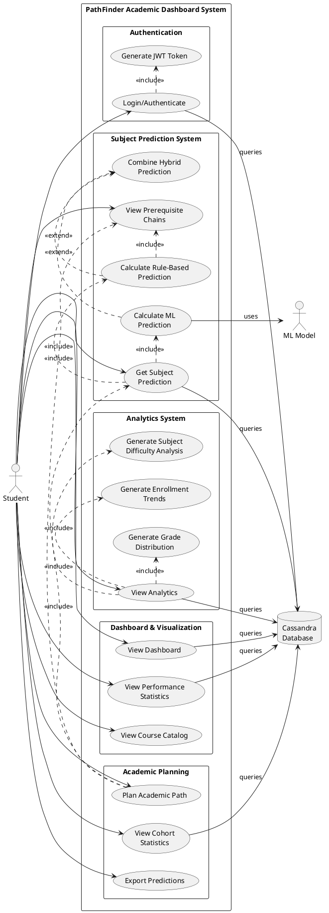

# PathFinder - Use Case Diagram

## System Overview
PathFinder is a personalized academic dashboard that helps students plan their course selections by predicting success probability using hybrid ML and rule-based algorithms.

---

## Use Case Diagram (Mermaid Syntax)

---

## PlantUML Syntax (for formal documentation)

---

## Detailed Use Case Descriptions

### Primary Actor: **Student**

### Use Cases

#### **UC1: Login/Authenticate**
- **Description**: Student logs in using their student ID and credentials
- **Precondition**: Student has valid account
- **Postcondition**: JWT token generated, student authenticated
- **Main Flow**:
  1. Student enters student ID and password
  2. System validates credentials against Cassandra database
  3. System generates JWT token
  4. Student redirected to dashboard

#### **UC2: View Dashboard**
- **Description**: Student views personalized dashboard with overview
- **Precondition**: Student is authenticated
- **Postcondition**: Dashboard displayed with student information
- **Main Flow**:
  1. System fetches student profile and enrolled subjects
  2. System displays current GPA, completed subjects
  3. System shows recent performance trends

#### **UC3: Get Subject Prediction**
- **Description**: Student requests success prediction for a subject
- **Precondition**: Student is authenticated
- **Postcondition**: Prediction displayed with confidence and factors
- **Main Flow**:
  1. Student selects target subject
  2. System calculates rule-based prediction (prerequisite analysis)
  3. System calculates ML prediction (Random Forest model)
  4. System combines predictions (70% ML + 30% rule-based)
  5. System displays:
     - Success probability (%)
     - Risk level (Low/Medium/High/Very High)
     - ML confidence score
     - Top contributing factors
     - Prerequisite performance
     - Recommendations

#### **UC3A: Calculate Rule-Based Prediction**
- **Description**: Analyze prerequisite performance using domain rules
- **Algorithm**:
  1. Identify prerequisites for target subject
  2. Calculate weighted GPA from prerequisite grades
  3. Assess missing prerequisites
  4. Apply risk thresholds (≥3.3=low, ≥2.7=medium, ≥2.0=high)
  5. Adjust for subject difficulty (historical pass rate)

#### **UC3B: Calculate ML Prediction**
- **Description**: Use Random Forest model to predict success
- **Algorithm**:
  1. Extract 23 features (GPA, prerequisites, cohort stats, etc.)
  2. Encode categorical variables (programme, gender, subject)
  3. Run inference through trained Random Forest (100 trees)
  4. Output probability and feature importance
  5. Calculate confidence score

#### **UC3C: Combine Hybrid Prediction**
- **Description**: Merge rule-based and ML predictions
- **Algorithm**:
  1. Weight ML prediction (70%)
  2. Weight rule-based prediction (30%)
  3. Combine: final = 0.7 × ML + 0.3 × rule-based
  4. Select risk level (use ML if available, else rule-based)

#### **UC4: View Analytics**
- **Description**: Student views cohort-level analytics
- **Precondition**: Student is authenticated
- **Postcondition**: Analytics charts and graphs displayed
- **Main Flow**:
  1. System generates enrollment trends over time
  2. System generates grade distribution histograms
  3. System analyzes subject difficulty (pass rates)
  4. System displays visualizations

#### **UC5: View Performance Statistics**
- **Description**: Student views personal academic statistics
- **Precondition**: Student is authenticated
- **Postcondition**: Statistics displayed
- **Metrics Shown**:
  - Overall CGPA
  - Year 1 GPA
  - Subjects completed
  - Pass/fail ratio
  - Grade distribution
  - GPA trend over time

#### **UC6: View Course Catalog**
- **Description**: Browse available courses and programmes
- **Precondition**: Student is authenticated
- **Postcondition**: Catalog displayed
- **Main Flow**:
  1. System displays programme variants (BCS, BCS-CSF, BCS-IS, etc.)
  2. System shows core courses and electives
  3. System displays semester plans

#### **UC7: Plan Academic Path**
- **Description**: Student plans future course selections
- **Precondition**: Student is authenticated
- **Postcondition**: Recommended courses displayed with predictions
- **Main Flow**:
  1. System identifies completed courses
  2. System filters available courses (prerequisites met)
  3. System runs predictions for each available course
  4. System ranks by success probability
  5. System suggests optimal course sequence

#### **UC8: View Prerequisite Chains**
- **Description**: View prerequisite relationships between courses
- **Precondition**: Student viewing a course
- **Postcondition**: Prerequisite tree displayed
- **Main Flow**:
  1. System identifies direct prerequisites
  2. System identifies prerequisite weights
  3. System displays prerequisite chain
  4. System shows student's performance in each prerequisite

#### **UC9: View Cohort Statistics**
- **Description**: Compare performance with cohort peers
- **Precondition**: Student is authenticated
- **Postcondition**: Cohort statistics displayed
- **Main Flow**:
  1. System filters students by cohort year
  2. System calculates cohort averages (GPA, pass rates)
  3. System compares student to cohort benchmarks
  4. System displays percentile ranking

#### **UC10: Export Predictions**
- **Description**: Export prediction results for offline review
- **Precondition**: Predictions have been generated
- **Postcondition**: Export file downloaded
- **Main Flow**:
  1. Student clicks export button
  2. System formats predictions as PDF/CSV
  3. System downloads file to student's device

---

## System Actors

### **ML Model (Random Forest)**
- **Role**: Secondary actor providing ML predictions
- **Responsibilities**:
  - Load trained model (100 decision trees)
  - Prepare 23 features from student data
  - Execute inference
  - Return probability and feature importance

### **Cassandra Database**
- **Role**: Data persistence layer
- **Responsibilities**:
  - Store student profiles
  - Store subject records and grades
  - Provide fast read access for queries
  - Maintain data consistency

---

## Non-Functional Requirements

### Performance
- Subject prediction: < 10ms response time
- Dashboard load: < 2 seconds
- Batch predictions (5 subjects): < 15ms
- ML model inference: < 7ms

### Scalability
- Support 10,000+ students
- Handle 100+ concurrent users
- Process 1,000+ predictions per second

### Reliability
- 99.9% uptime
- Graceful ML fallback to rule-based
- Session persistence with JWT

### Security
- JWT authentication (HS256)
- 24-hour token expiration
- HTTPS encryption in production
- CORS protection

---

## Technology Stack

- **Frontend**: React 18 + TypeScript + Material-UI
- **Backend**: FastAPI (Python 3.13)
- **Database**: Apache Cassandra
- **ML Framework**: scikit-learn (Random Forest)
- **Authentication**: JWT (JSON Web Tokens)
- **API**: RESTful JSON

---

*This use case diagram can be rendered using PlantUML or Mermaid diagram tools for inclusion in formal documentation.*
